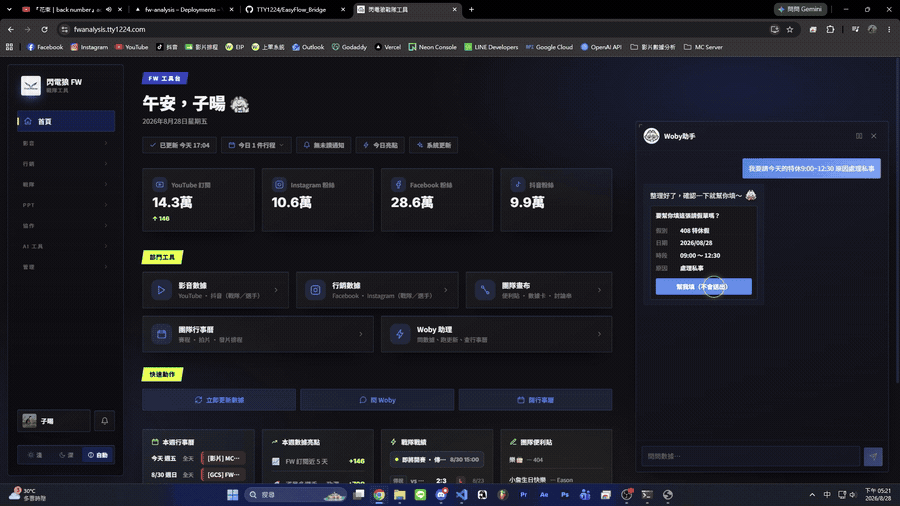

# EasyFlow 橋接

在**你自己的電腦**上幫忙填單（EasyFlow）的小程式。

在數據網站上跟 Woby 說「幫我請 9/18 特休」，它就會在你電腦上開瀏覽器、登入 EasyFlow、把假單填好，填好的畫面會截一張圖傳回聊天室。

> **它不會自己送出。** 什麼時候送是你在聊天室按下「確定發送」才發生。



跟 Woby 說「我要請今天的特休 9:00~12:30，原因處理私事」→ 它在你電腦上把假單填好 → 截圖回聊天室 → 你自己按「確定發送」。
（[完整版影片](docs/demo.mp4)，70 秒、含聲音，點了會下載。）

戰隊主管還可以**一次幫多位選手上單**（請假申請／加班調休申請）：一人一張、逐張存成草稿，全部填完之後再決定要不要一起送。

還可以查：**可休時數**、**請假記錄**、**刷卡記錄**。查過一次之後 Woby 就記得了，下次直接問就好。

## 運作邏輯

網站只負責「決定要填什麼」，登入和填單都發生在**你自己的電腦**上。

```
            ┌──────────────────────────────┐
            │      數據網站（Vercel）       │
            │ Woby ＋ /api/leave/*         │
            │ · 把「要填什麼」整理成指令     │
            │ · 用你的授權碼簽章            │
            │ · 從頭到尾不知道你的公司密碼   │
            └──────────────────────────────┘
                            │
       req/q/b/a（帶簽章） ▼│▲ status / filled / qres / acted
                            │
  ┌───────────────────────────────────────────────────┐
  │                     Supabase                      │
  │ Realtime 頻道 —— 每人一條，頻道名由授權碼衍生        │
  │ app_settings   leave:token:<email>                │
  │                hr:<email>:balance｜history｜punch │
  └───────────────────────────────────────────────────┘
               │                               │
┌────────────────────────────┐  ┌────────────────────────────┐
│          你的電腦           │  │         同事的電腦          │
│ EasyFlow 橋接               │  │ EasyFlow 橋接              │
│ · 只認自己授權碼簽的指令     │  │ · 自己的授權碼              │
│ · 帳密留在本機，DPAPI 加密   │  │ · 自己的帳密                │
└────────────────────────────┘  └────────────────────────────┘
               │ 驅動 Edge／Chrome 登入、填單  │
               ▼                               ▼
           ┌───────────────────────────────────────┐
           │       EasyFlow（公司簽核系統）          │
           │ 填好 → 停住，你按「確定發送」才會送簽    │
           └───────────────────────────────────────┘
```

一次填單走過的路：

1. 你在網站上跟 Woby 說「幫我請 9/18 特休」
2. 網站解析成指令（假別、日期、時間、原因），**用你的授權碼簽章**
3. 經 Supabase Realtime 送到**你那條專屬頻道**
4. 你電腦上的橋接驗章 → 用本機的帳密開 Edge（或 Chrome）登入 EasyFlow
5. 填好、按「計算」→ **停手**，順便截一張圖傳回聊天室給你核對
6. 你自己看過，按「確定發送」送簽／「儲存草稿」存著不送／「取消」關掉什麼都不留

你按的那個動作本身也會進簽章，所以「存草稿」的指令不可能在半路被改成「送出」。

批次代填走同一條路，只是第 4～5 步重複跑：一個人填完按「草稿儲存」再換下一位（不存就沒辦法接著填下一個）。全部跑完聊天室會列出結果，你可以「全部送出」或留著草稿自己處理。橋接是比對跑之前／跑之後的草稿匣來認出這批單子的，**數量對不上就整批不給送**。

查詢（可休時數／請假記錄／刷卡記錄）走同一條路，只是最後把表格傳回來，
並存進 `app_settings`。之後 Woby 直接回答，不用再開一次瀏覽器。

每個人的頻道名和簽章金鑰都由**他自己的授權碼**衍生，所以 A 的橋收不到、也認不得 B 的指令。

---

## 你的密碼會怎麼被處理

**伺服器永遠看不到你的公司密碼。**

- 密碼只存在你電腦的 `%APPDATA%\EasyFlowBridge\config.json`
- 存之前用 **Windows 內建的 DPAPI** 加密，綁「這台電腦 + 這個 Windows 帳號」。檔案複製到別台電腦解不開
- 網站送過來的只有「要填什麼」（假別、日期、原因）＋一段簽章，**裡面沒有任何密碼**
- 換電腦或換 Windows 帳號 → 解不開 → 要重新設定（這是刻意的）

### 授權碼要當密碼看

授權碼同時是「你的頻道名來源」和「簽章金鑰」。拿到它的人可以對你的橋下指令 —— 在你電腦上以你的名義填單，**而且送得出去**。

不要外流。真的流出去了就到網站上換一組新的，舊的立刻失效。
